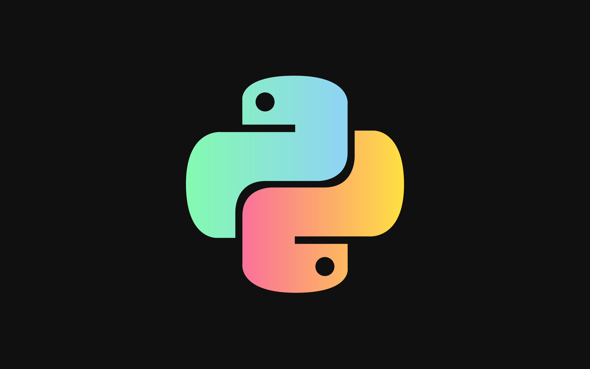

  

<h1 align="center">PYTHON</h1>

Automation | APIs | Database | Networking | Cybersecurity | DevOps

### Professional Technical Portfolio | Long-Term Engineering Repository

## Overview

Este repositorio representa un dominio especializado dentro de mi portafolio técnico profesional, enfocado en el desarrollo de soluciones utilizando Python para automatización, administración de sistemas, integración de plataformas, procesamiento de datos y desarrollo de herramientas orientadas a entornos empresariales.

Su contenido documenta la aplicación práctica de Python mediante laboratorios, proyectos, documentación técnica y soluciones utilizadas en escenarios reales de ingeniería.

---

## Purpose

El propósito de este repositorio es desarrollar competencias profesionales relacionadas con el uso de Python como lenguaje de automatización, integración y desarrollo de soluciones técnicas.

Los principales objetivos incluyen:

- Desarrollar habilidades sólidas de programación.
- Automatizar tareas administrativas.
- Integrar plataformas y servicios.
- Desarrollar herramientas reutilizables.
- Documentar soluciones técnicas.
- Construir evidencia práctica del aprendizaje continuo.

---

## Scope

Este repositorio contempla áreas relacionadas con la aplicación de Python como lenguaje de programación orientado a la automatización, integración y desarrollo de soluciones utilizadas en entornos empresariales.

Los principales dominios incluidos son:

- Python Fundamentals
- Infrastructure Automation
- Cloud Automation
- System Administration
- Network Automation
- Cybersecurity Automation
- Database Integration
- REST API Integration
- Enterprise Scripting
- File Processing
- Data Processing
- Performance & Optimization

---

## Technical Domains

Los principales dominios contemplados dentro del repositorio son:

### Python Fundamentals

Fundamentos del lenguaje Python orientados a la construcción de una base sólida para el desarrollo de soluciones de automatización, integración y administración de infraestructura.

---

### Infrastructure Automation

Automatización de tareas relacionadas con administración de infraestructura, servidores, sistemas operativos y procesos empresariales utilizando Python.

---

### Cloud Automation

Automatización de recursos y servicios en plataformas Cloud, con énfasis en Microsoft Azure y futuras integraciones con otros proveedores de nube.

Incluye:

- Azure SDK
- Azure CLI
- Azure Resource Management
- Automatización de recursos
- Automatización de despliegues

---

### System Administration

Desarrollo de scripts para administración de sistemas Linux y Windows.

Incluye:

- Gestión de usuarios
- Procesos
- Servicios
- Archivos
- Logs
- Inventarios
- Automatización administrativa

---

### Network Automation

Automatización de dispositivos y servicios de red mediante Python.

Incluye:

- SSH
- APIs
- Automatización de equipos de red
- Recolección de información
- Configuración automatizada

---

### Cybersecurity Automation

Automatización de tareas relacionadas con seguridad informática y Blue Team.

Incluye:

- Análisis de logs
- Hashing
- Automatización defensiva
- Validación de configuraciones
- Scripts de auditoría

---

### Database Integration

Integración de aplicaciones Python con motores de bases de datos empresariales.

Incluye:

- Oracle
- PostgreSQL
- MySQL
- SQL Server
- MongoDB

---

### REST API Integration

Consumo e integración de APIs REST utilizadas en plataformas empresariales y servicios Cloud.

Incluye:

- JSON
- Requests
- Autenticación
- Tokens
- Integraciones

---

### Enterprise Scripting

Desarrollo de scripts reutilizables para automatizar procesos operativos y administrativos en ambientes empresariales.

---

### File Processing

Procesamiento automatizado de diferentes formatos de archivos.

Incluye:

- CSV
- JSON
- XML
- YAML
- Excel
- PDF

---

### Data Processing

Transformación, validación y manipulación de datos utilizados por aplicaciones, servicios y procesos automatizados.

---

